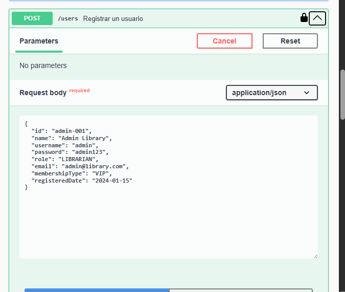
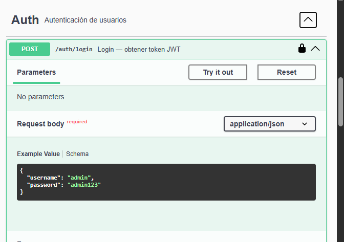
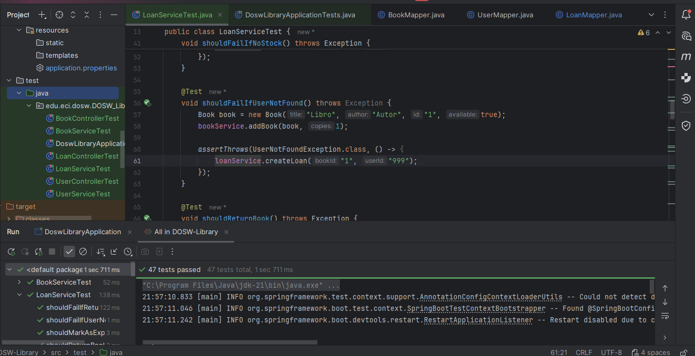
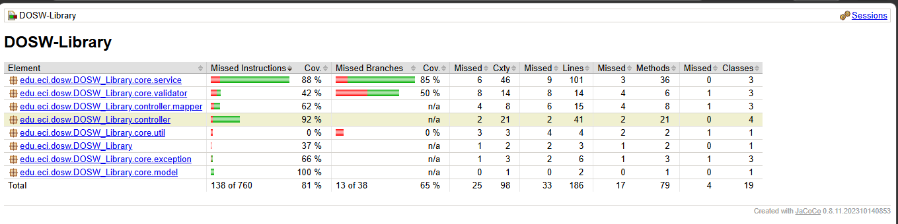
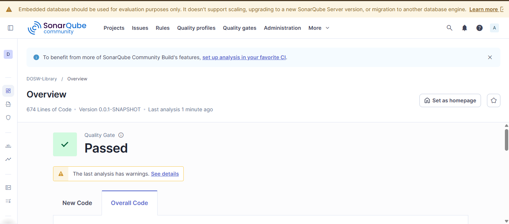
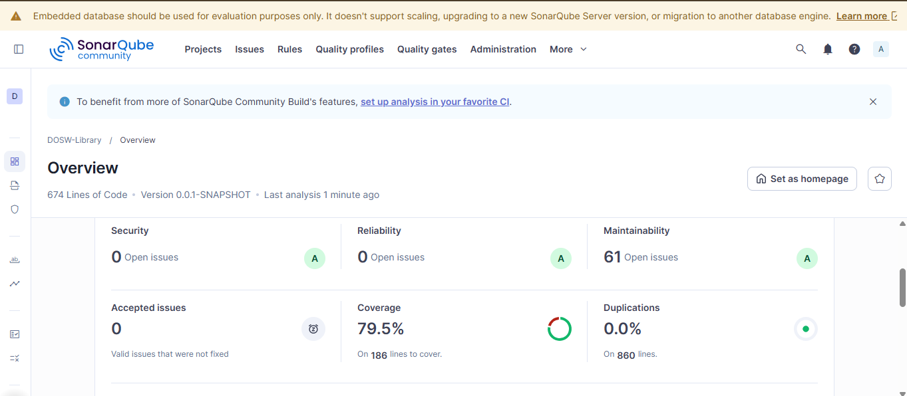
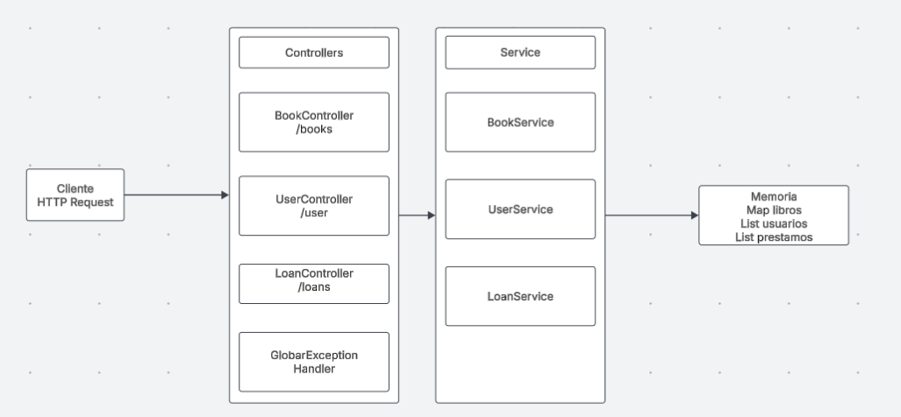
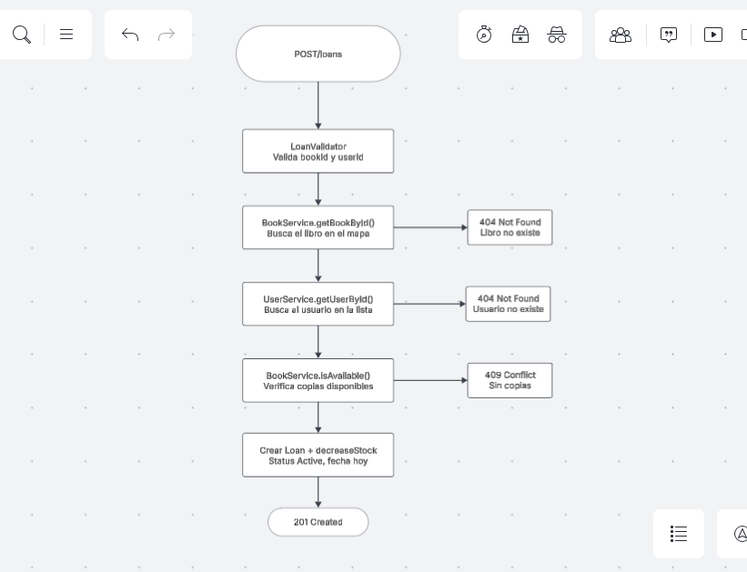
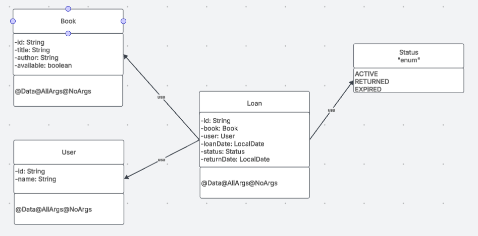

# DOSW-Library

Sistema de gestión de biblioteca desarrollado con **Spring Boot** como parte del curso de Desarrollo de Software (DOSW). Permite gestionar libros, usuarios y préstamos de manera organizada, con validaciones, manejo de errores y documentación de API.

## Documentación API — Swagger

La API está completamente documentada con Swagger. Con la aplicación corriendo, se puede acceder a la documentación interactiva en:
http://localhost:8081/swagger-ui/index.html

Desde esta interfaz se pueden probar todos los endpoints directamente sin necesidad de herramientas externas como Postman.

## Pruebas unitarias

Se implementaron **47 pruebas** distribuidas en 6 clases de prueba, cubriendo tanto escenarios exitosos como escenarios de error para los tres módulos del sistema.

### Resultados de las pruebas

## Cobertura de pruebas — JaCoCo

El análisis de cobertura se realizó con JaCoCo

## Análisis estático — SonarQube

Se realizó el análisis estático del código con SonarQube, obteniendo los siguientes resultados:

## Diagramas

### Diagrama general — arquitectura del sistema
Muestra la comunicación entre el cliente, los controllers y los services.
El cliente envía peticiones HTTP que son recibidas por los controllers,
quienes delegan la lógica a los services. Estos gestionan los datos
en memoria usando un Map de libros, una List de usuarios y una List de préstamos.

### Diagrama específico — flujo de crear un préstamo
Muestra el flujo completo del endpoint POST /loans, incluyendo todas
las validaciones y posibles errores que pueden ocurrir en el proceso.

### Diagrama de clases
Muestra los modelos del sistema con sus atributos y las relaciones entre ellos.
Loan contiene referencias a Book y User, y usa el enum Status
para controlar el estado del préstamo.

